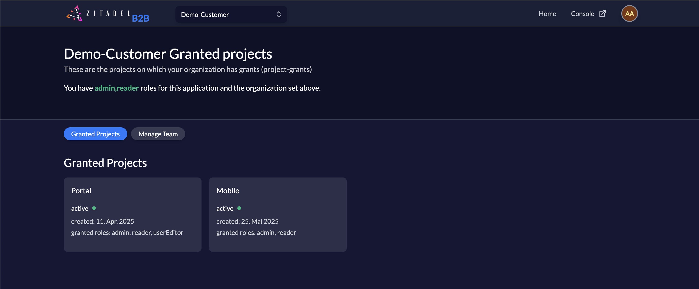

# ZITADEL NextJS B2B Demo

This is a demo showcasing how you can use ZITADEL in a B2B (Business-to-Business) context, where a company is providing a customer portal to their customers:

- A user of the customer should see all granted projects in the portal ("Service discovery")
- An admin user of the customers sees a list of customer's users and can manage user grants with role assignment
- Users can invite new users to their organization with automatic email invitations
- Comprehensive search functionality for finding users by name, email, or username
- Fully responsive design optimized for desktop, tablet, and mobile devices

## What does it do?

Users with `reader` role can view granted projects on their organization which were granted by your organization (owning this portal application).
Users with `admin` role can view granted projects and manage users of the selected organization, including:

- **View User Grants**: See all users who have access to granted projects with clear role indicators
- **Real-Time Search**: Instantly find users by searching across display name, email, username, first name, last name, or preferred login name
- **Add User Grants**: Grant project access to existing users with searchable user selection and role assignment
- **Edit User Roles**: Modify roles assigned to users for specific projects with inline editing
- **Remove User Grants**: Revoke project access from users with confirmation dialogs
- **Invite New Users**: Create new users with automatic invitation emails sent via ZITADEL
- **Mobile-First Design**: Fully responsive interface that works seamlessly on all device sizes
- **Progressive Enhancement**: Enhanced user experience with debounced search, loading states, and optimistic updates



## Key Features

### 🔍 Advanced Search Functionality
- **Real-time user search** with instant results as you type
- **Multi-field search** across display name, email, username, first name, last name, and preferred login name
- **Debounced input** for optimal performance with large user bases
- **Search result counters** to show filtered results
- **Clear search** functionality with one-click reset

### 📱 Mobile-First Responsive Design
- **Responsive grid layouts** that adapt from single column on mobile to multi-column on larger screens
- **Touch-friendly interfaces** with properly sized buttons and touch targets
- **Mobile navigation menu** with integrated profile management
- **Responsive typography** that scales appropriately across device sizes
- **Optimized user experience** for phones, tablets, and desktop computers

### 👥 Enhanced User Management
- **Searchable user selection** when adding user grants (no more scrolling through long dropdown lists)
- **Inline role editing** directly within the user grants table
- **User invitation system** with automatic email notifications
- **Batch operations** for efficient user management
- **Visual role indicators** for quick identification of user permissions

### ⚡ Performance Optimizations
- **Client-side filtering** for instant search results without server round-trips
- **Memoized computations** to prevent unnecessary re-renders
- **Optimistic updates** for better perceived performance
- **Efficient state management** with proper React patterns
- **Scalable architecture** designed to handle hundreds or thousands of users

## Step 1: Setup Vendor application and users in ZITADEL

First we need to create an organization that holds the Vendor's users, projects and applications.

### Vendor Organization

Navigate to `https://{YourDomain}.zitadel.cloud/ui/console/orgs` (replace {YourDomain}), and click on the button "New".
Toggle the setting "Use your personal account as organization owner".

Enter the name `Demo-Vendor`, and click "Create". Then click on that organization.

### Portal Web Application

To setup this sample you have to create a project and an application in the vendor organization (`Demo-Vendor`) first.

Open the Console (`https://{YourDomain}.zitadel.cloud/ui/console/projects`) and create a new project. Let's call it `Portal`.

Then on the project detail page click on new application and enter a name for this app.
Let's call this one `portal-web`.
Select `Web`, continue, `Code`, then enter `http://localhost:3000/api/auth/callback/zitadel` for the redirect, and `http://localhost:3000` for the post redirect. 
Enable `Development Mode` to allow a redirect to localhost.
Then press on `create`.

Copy the "Client Secret" from the newly created `portal-web` application as you will need this in your environment configuration file later.

Click on the application `portal-web`.
To read the user data and roles from ID Token, go to the section Token Settings and make sure both checkboxes, `User roles inside ID Token` and `User Info inside ID Token` are enabled.
Make sure to save your changes.

Copy the "Resource Id" of the application `portal-web` as you will need this in your environment configuration file later.

### Roles

To setup the needed roles for your project, navigate to your `Portal` project, and add the following roles

| Key    | Display Name  | Group | Description                                                            |
| :----- | :------------ | :---- | ---------------------------------------------------------------------- |
| admin  | Administrator |       | The administrator, allowed to read granted projects and manage user grants |
| reader | Reader        |       | A user who is allowed to read his organizations granted projects only  |

Now in the `General` section of the Portal project, make sure to enable `Assert Roles on Authentication`.
This makes sure that roles, which is used by the application to enable UI components, are set in your OIDC ID Token.

## Step 2: Create a customer organization

### Customer organization

Create a new organization in Console. Easiest way is to use the organization dropdown on the top left.
Let's call this new organization `Demo-Customer`.

### Users

Now switch back to the organization `Demo-Customer` and [create a new user](https://zitadel.com/docs/guides/manage/user/reg-create-user) in this organization.
Let's call the first user `Alice Admin`. Create a second user called `Eric Employee`.

### Manager Role

We want to enable Alice to assign roles to users in her organization in a self-service manner.
To make this happen, we need give Alice an [Manager Role](https://zitadel.com/docs/concepts/structure/managers) within the Organization `Demo-Customer`.

Still in the organization `Demo-Customer`, navigate to Organization. Click on the plus on the top right and give `Alice Admin` the Manager Role `Org Owner`.

Login with your user on the customer organization to validate the setup.

### Service User

To make the application work you need a service user which loads granted-projects and user-grants for you.
In the `Demo-Vendor` organization on the Console, navigate to `Users`, click on `Service Users` and create a new user.
Let's set its username to `nextjs` and its name to `NextJS`. Then press `create`.

On the detail page of that user, navigate to "Personal Access Tokens" and add a new entry, set an optional expiration date.

Copy the generated Token as you will need this in your environment configuration file later.

Go back to the `Portal` project and add the Service User as Manager (top right).
Make sure to select `Project Owner Viewer Global` as the management role.

To show granted projects, still in the `Demo-Vendor` organization, add the Service User as `Org Project Permission Editor` Manager.

To manage user grants and invite new users, go to the `Demo-Customer` organization and add the Service User as `Org User Manager` Manager. Click on "If you want to grant a user of an other organization click here" to be able to search the user across organizations.

## Step 3: Configuration

Now clone this project and navigate to its root folder.
Create a file `.env.local` and copy paste the following:

```text
NEXTAUTH_URL=http://localhost:3000
PUBLIC_NEXT_ZITADEL_API=https://{YourDomain}.zitadel.cloud
ZITADEL_API=https://{YourDomain}.zitadel.cloud
ORG_ID={YourOrgId}
ZITADEL_CLIENT_ID={YourClientID}
ZITADEL_CLIENT_SECRET={YourClientSecret}
SERVICE_ACCOUNT_ACCESS_TOKEN={YourServiceAccountSecret}
NEXTAUTH_SECRET=randomsecret
```

Replace the values as follows

`NEXTAUTH_URL`: Base url of this demo app (B2B portal); runs per default on [http://localhost:3000](http://localhost:3000)

`PUBLIC_NEXT_ZITADEL_API`: The url to your zitadel instance. When using zitadel.cloud for this demo you can find the domain of your ZITADEL instance in the customer portal. You can also find this information by going to your application `portal-web` and click 'Urls' in the navigation. The variable is prefixed with `PUBLIC_NEXT` such that it can be accessed from the client.

`ZITADEL_API`: URL of the Management API. The same as `PUBLIC_NEXT_ZITADEL_API`.

`ORG_ID`: (Optional) You can find `{YourOrgId}` by selecting the `Demo-Vendor` organization in Console. `{YourOrgId}` is displayed on top of the organization detail page as "Resource Id". The application now dynamically handles multiple organizations, so this is only used as a fallback when no organization is specified in the user's session.

`ZITADEL_CLIENT_ID`: Having the project `Portal` selected, click on the Application `portal-web`. `{YourClientID}` is displayed as a field in the OIDC configuration, labelled "Client Id".

`ZITADEL_CLIENT_SECRET`: You should have saved the Client Secret when creating the `portal-web` application. Otherwise, having the project `Portal` selected, click on the Application `portal-web`. There, clicking on the "Actions" dropdown menu, you can Regenerate the Client Secret for the application.

`SERVICE_ACCOUNT_ACCESS_TOKEN`: From the Service User created in step 2, you should have saved the Personal Access Token. Add it here.

## Step 4: Install and Run

To run this sample locally you need to install dependencies first.

Type and execute:

```bash
yarn install
```

then, to run the development server:

```bash
npm run dev
# or
yarn dev
```

and open [http://localhost:3000](http://localhost:3000) with your browser to see the result.

## Step 5: Create a project grant

### Organization Grant

Go to the `Demo-Vendor` organization, select Projects in the navigation, and click on `Portal` and then `Grants`.
[Grant all roles of the Project](https://zitadel.com/docs/guides/manage/console/projects#grant-a-project) to the organization `demo-customer.{YourDomain}.zitadel.cloud`.

### Authorization

As you have guessed, these two users need to be authorized.
On the `Demo-Customer` organization, navigate to Projects and select "Granted Projects" in the sub-navigation.
Select the project portal `Portal` and navigate to "Authorizations".

Give `Alice Admin` the roles `reader` and `admin`.
`Eric Employee` will get only the role `reader`.

### Login

You should be able to login to the Demo Application with `Alice Admin` and see all granted projects. And from the Manage Team tab you can see a list of users with existing grants, and can manage user grants with role assignment. You can also invite new users to the `Demo-Customer` organization with automatic email invitations. 

You can log out and log in with `Eric Employee` and you should only have access to the granted projects, but not to the Manage Team tab.

## Deploy

### Deploy to Vercel

To deploy your own version on Vercel, setup your instance like the description above and provide the variables in the dedicated fields for the environment.

[](https://vercel.com/new/clone?repository-url=https%3A%2F%2Fgithub.com%2Fzitadel%2Fzitadel-nextjs-b2b&env=NEXTAUTH_SECRET,NEXTAUTH_URL,ORG_ID,SERVICE_ACCOUNT_ACCESS_TOKEN,ZITADEL_API,PUBLIC_NEXT_ZITADEL_API,ZITADEL_CLIENT_ID,ZITADEL_CLIENT_SECRET&project-name=zitadel-b2b&repository-name=zitadel-b2b)

### Containerize

Build the image
`docker build -t zitadel-b2b-demo .`

Then run the image, loading the environment variable file
`docker run --env-file .env.local -p 3000:3000 zitadel-b2b-demo`

## What next

You could create another project (eg, `Data Cube`) and grant that project to the customer organization. The granted project should appear after a reload automatically. This gives you an idea of how you could do Service Discovery with ZITADEL.

You could also build out the code (PRs welcome :wink:) for this application, for example:

- Create a mock `datacube-web` application and show how SSO between the portal and the application works with ZITADEL.
- Add bulk user operations for managing multiple users at once.
- Implement user activity tracking and audit logs.
- Add data export functionality for user grants and project access.

## Technical Implementation

### Search Architecture
The application implements a scalable search solution that:
- Fetches all user grants on initial load (up to 1000 users by default)
- Performs client-side filtering using `useMemo` for optimal performance
- Uses debounced input (300ms delay) to prevent excessive filtering during typing
- Searches across multiple user properties simultaneously

### Responsive Design Patterns
The UI uses modern CSS Grid and Flexbox patterns with Tailwind CSS:
- CSS Grid with responsive column counts: `grid-cols-1 sm:grid-cols-2 lg:grid-cols-3 xl:grid-cols-4`
- Mobile-first approach with progressive enhancement
- Responsive text sizing: `text-sm sm:text-base lg:text-lg`
- Adaptive spacing and padding for different screen sizes

### State Management
- React hooks (`useState`, `useEffect`, `useMemo`) for efficient state management
- Proper cleanup and reset patterns for modal dialogs
- Optimistic UI updates for better user experience
- Centralized loading states and error handling

### API Integration
- ZITADEL Management API integration for user and grant operations
- Service account authentication for backend operations
- Email invitation system using ZITADEL's user creation API
- Proper error handling and user feedback for all operations
